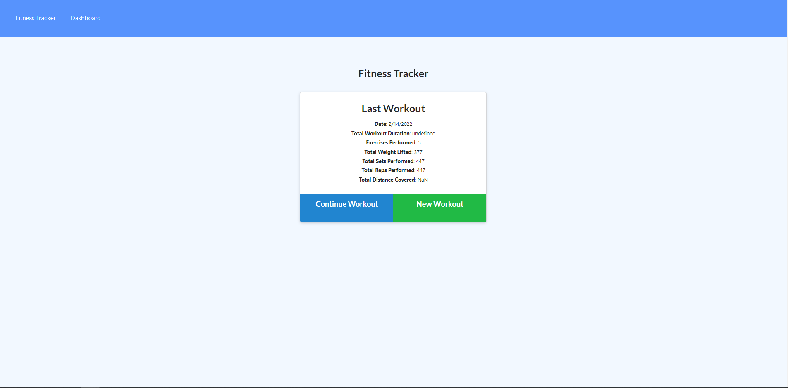

# Workout-Tracker

## Description
- The motivation was to a cloud database through mongodb.
- Learn how to implement a cloud database. 
- Moving data from frontend to backend through a cloud database.  
- Learned how to utilize data and attach it to frontend. 

## Table of Contents (Optional)
- [Installation](#installation)
- [Usage](#usage)
- [License](#license)
- [Features](#features)

## Usage

[Heroku Deployed Application](https://powerful-mesa-58882.herokuapp.com/?id=620ae30c0b086700164ab986)

## License

## Features
- Allows user to create a workout and track progress through dashboards.
- Cloud database that is conncetd and updates based on user input.
- Dynamic UI that adjust based on which workouts the user will be partaking in. 
